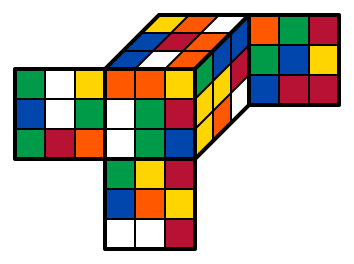

# RubikView

2D render for [RubikCore.jl](https://github.com/minhcly95/RubikCore.jl).

This package enables the display of `Cube` from [RubikCore.jl](https://github.com/minhcly95/RubikCore.jl)
as images in [IJulia](https://github.com/JuliaLang/IJulia.jl),
[VS Code](https://github.com/julia-vscode/julia-vscode), and [Juno](https://junolab.org/).
See [this Jupyter notebook](docs/RubikViewDemo.ipynb) for examples.

